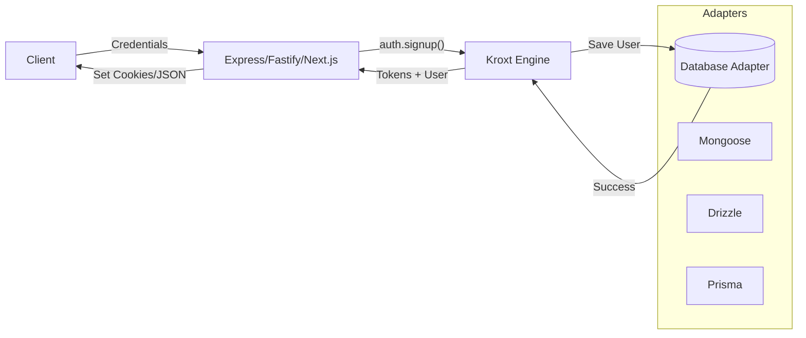

# Kroxt 🖤🤍

A framework-agnostic, modular authentication engine for modern TypeScript applications. Built for security, extensibility, and pure developer joy.

[](https://www.npmjs.com/package/kroxt)
[](https://opensource.org/licenses/MIT)

> [!IMPORTANT]
> **What's New in v1.3.0**: The **Kroxt CLI** is here! Bootstrap your entire auth engine in seconds with `npx kroxt init`. Also featuring a premium **Monochrome rebranding** and advanced **IP-Blocking** defense.

---

## ⚡ Quick Start (The Recommended Way)

The fastest way to get started with Kroxt is using our interactive initializer:

```bash
npx kroxt init
```

This will guide you through:
- 🏗️ Choosing your database adapter (**Mongoose**, **Prisma**, **Drizzle**, or **Memory**).
- 🛡️ Configuring security layers (**Rate Limiting**, **IP Blocking**, **Peppering**).
- 🔑 Generating secure **JWT_SECRET** and **JWT_PEPPER** in your `.env`.
- ⚙️ Setting up a modern **tsconfig.json**.

---

## 🚀 Why Kroxt?

Authentication is often either too complex or too restrictive. Kroxt is the **"Headless" Auth Engine** that gives you the best of both worlds:

- **🏗️ Database Agnostic**: Native adapters for **Prisma**, **Drizzle**, and **Mongoose**.
- **🛠️ Modular**: Use only what you need. No forced session managers or UI components.
- **🔐 Security First**: Argon2 hashing, dual-token rotation, and **IP-based brute force protection** built-in.
- **🧩 TypeScript Native**: Perfectly preserves your user schemas and metadata.

---

## 🗺️ How it Works

Kroxt sits between your database and your controller logic. It handles the "heavy lifting" (hashing, JWT signing, token rotation) while you maintain full control over your API.



---

## 🛡️ Core Authentication Flows

### **Registration**
```typescript
const { user, accessToken, refreshToken } = await auth.signup({ 
  email, 
  name, 
  role: 'user' 
}, password);
```

### **Login**
```typescript
const { user, accessToken, refreshToken } = await auth.loginWithPassword(email, password);
```

### **Token Refresh**
```typescript
const { accessToken } = await auth.refresh(refreshToken);
```

---

## 🛠️ Advanced: Custom JWT Payloads

Want to share a user's `role` or `plan` with the frontend via the JWT? Use the `payload` hook:

```typescript
export const auth = createAuth({
  adapter,
  jwt: {
    payload: (user, type) => {
      if (type === "access") {
        return { 
          role: user.role, 
          schoolId: user.schoolId 
        };
      }
      return {};
    }
  }
});
```

---

## 🔗 Reference Projects

Complete working implementations for all frameworks:
- [Kroxt Examples (All Frameworks)](https://github.com/adepoju-oluwatobi/kroxt-examples)

## 📄 License

MIT © [Adepoju Oluwatobi](https://github.com/adepoju-oluwatobi)
