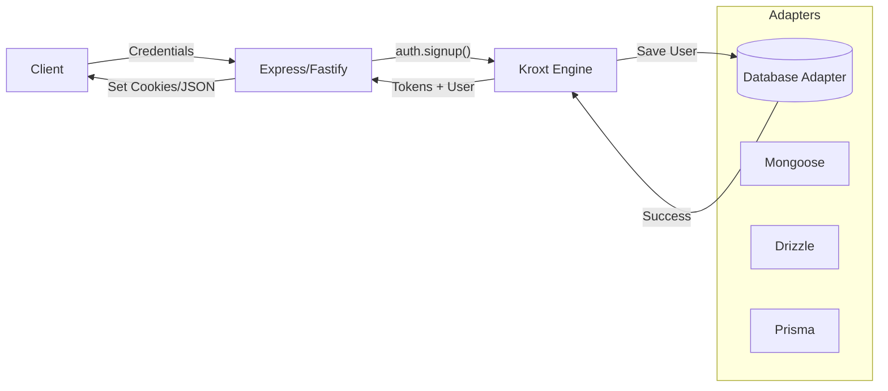

# kroxt 🔐

A framework-agnostic, modular authentication engine for modern TypeScript applications. Built for security, extensibility, and pure developer joy.

[](https://www.npmjs.com/package/kroxt)
[](https://opensource.org/licenses/MIT)
[](./SECURITY.md)

> [!IMPORTANT]
> **What's New in v1.2.2**: Hardened CSRF protection (Regex + Hex comparisons), official Security Policy (`SECURITY.md`), standalone security examples, and full TypeScript support for all framework samples. [Read the full Changelog](./CHANGELOG.md).

## 🚀 Why Kroxt?

Authentication is often either too complex (Passport, Auth.js) or too restrictive. Kroxt is the **"Headless" Auth Engine** that gives you the best of both worlds:

- 🏗️ **Database Agnostic**: Native adapters for **Prisma**, **Drizzle**, and **Mongoose**.
- 🛠️ **Modular**: Use only what you need. No forced session managers or UI components.
- 🔐 **Security First**: Argon2 hashing, dual-token rotation, and timing-attack protection built-in.
- 🧩 **TypeScript Native**: Perfectly preserves your user schemas and metadata.

---

## 🗺️ How it Works

Kroxt sits between your database and your controller logic. It handles the "heavy lifting" (hashing, JWT signing, token rotation) while you maintain full control over your API.



---

## 🏁 Quick Start (5 Minutes)

### 1. Installation

```bash
npm install kroxt
```

### 2. Choose Your Adapter

Kroxt provides official adapters for the most popular ORMs.

#### **Option A: Drizzle (SQLite/PG/MySQL)**
```typescript
import { createDrizzleAdapter } from "kroxt/adapters/drizzle";
import { db } from "./db";
import { users } from "./schema";
import { eq } from "drizzle-orm";

export const adapter = createDrizzleAdapter(db, users, eq);
```

#### **Option B: Prisma**
```typescript
import { createPrismaAdapter } from "kroxt/adapters/prisma";
import { prisma } from "./db";

export const adapter = createPrismaAdapter(prisma.user);
```

#### **Option C: Mongoose**
```typescript
import { createMongoAdapter } from "kroxt/adapters/mongoose";
import { User } from "./models/user.model";

export const adapter = createMongoAdapter(User);
```

### 3. Initialize the Engine

```typescript
import { createAuth } from "kroxt/core";
import { adapter } from "./auth-adapter";

export const auth = createAuth({
  adapter,
  secret: process.env.JWT_SECRET,
  session: {
    expires: "15m",
    refreshExpires: "7d"
  }
});
```

---

## 🛡️ Core Authentication Flows

### **Registration**
```typescript
const { user, accessToken, refreshToken } = await auth.signup({ 
  email, 
  name, 
  role: 'user' 
}, password);
```

### **Login**
```typescript
const { user, accessToken, refreshToken } = await auth.loginWithPassword(email, password);
```

### **Token Refresh**
```typescript
const { accessToken } = await auth.refresh(refreshToken);
```

---

## 🐣 Beginner Corner: What is "Headless"?

If you're new to backend development, "Headless" means Kroxt **doesn't provide a UI** (no login buttons or pre-made forms). Instead, it provides the **engine** (the logic). 

**Why is this good?**
It means you can build your own login screen in React, Vue, or even a Mobile App, and Kroxt will handle the security part on the server exactly the same way every time.

---

## 🛠️ Advanced: Custom JWT Payloads

Want to share a user's `role` or `plan` with the frontend via the JWT? Use the `payload` hook:

```typescript
export const auth = createAuth({
  adapter,
  jwt: {
    payload: (user, type) => {
      if (type === "access") {
        return { 
          role: user.role, 
          tier: user.subscriptionTier 
        };
      }
      return {}; // Keep refresh tokens small
    }
  }
});
```

---

## 🛑 Common v1.2.0 Troubleshooting

### "Cannot find module '.prisma/client/default.js'" (ESM on Windows)
If you're using Prisma with ESM (`"type": "module"`) on Windows, you may need a robust import in your `src/db/index.ts`:

```typescript
import { createRequire } from "module";
const require = createRequire(import.meta.url);
const { PrismaClient } = require("@prisma/client");
```

### Prisma "Unknown argument `name`"
Prisma is strict about schemas. If you're sending extra fields in `auth.signup()`, ensure your `schema.prisma` includes them (marked as `?` optional if needed).

---

## 🔗 Reference Projects

Complete working implementations for all frameworks:
- [Kroxt Examples (All Frameworks)](https://github.com/adepoju-oluwatobi/kroxt-examples)
- [Hono + Drizzle + SQLite](https://github.com/adepoju-oluwatobi/kroxt-examples/tree/main/hono/kroxt-hono-drizzle)
- [Express + Prisma + DB](https://github.com/adepoju-oluwatobi/kroxt-examples/tree/main/express/kroxt-express-prisma)
- [Fastify + Mongoose](https://github.com/adepoju-oluwatobi/kroxt-examples/tree/main/fastify/kroxt-fastify-mongo)

## 📄 License

MIT © [Adepoju Oluwatobi](https://github.com/adepoju-oluwatobi)
